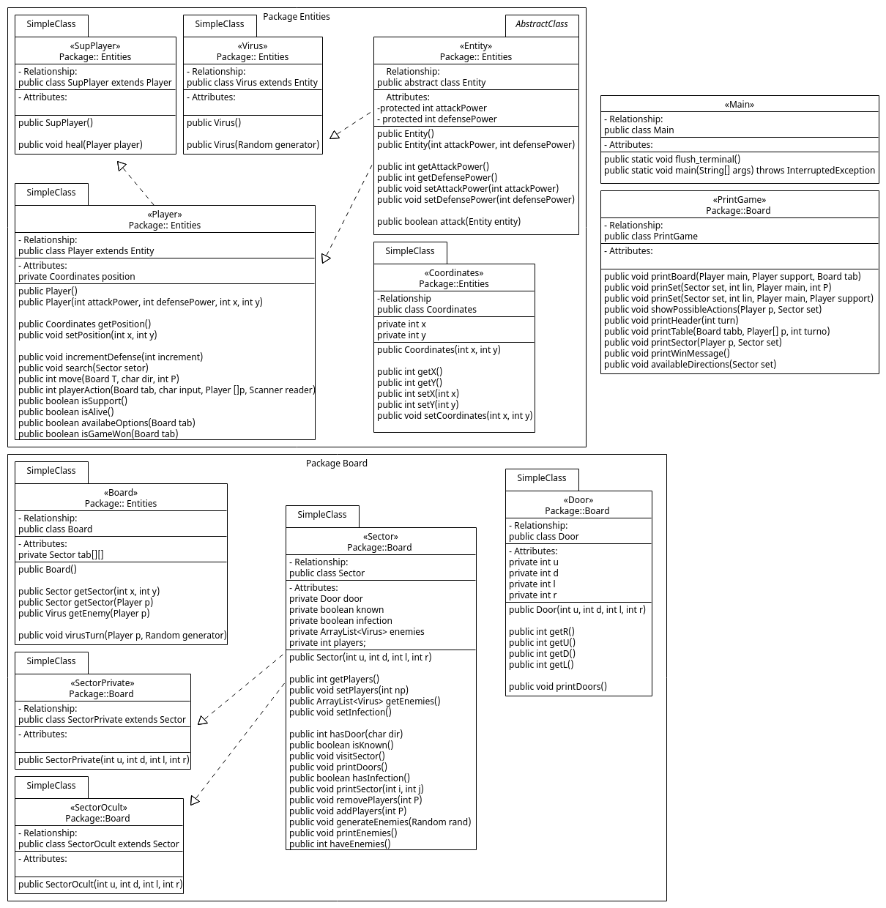

### Link do Replit:
https://replit.com/@herijooj/TrabalhoCI1062?v=1

## Introdução

O trabalho proposto consiste em implementar o jogo "antivírus por um dia" seguindo os conceitos de orientação a objetos. O jogo funciona por turnos, onde o jogador Principal e o Secundário se movem em um Tabuleiro de setor em setor, tendo que enfrentar os vírus que estão em cada setor. Até que algum dos jogadores cheguem até o setor onde se encontra a infecção.

Temos mecânicas como: se mover entre os setores, turnos, ataque/defesa, recuperação de defesa (apenas para o jogador Secundário), ataque dos vírus, entre outros.

## Desenvolvimento

Para abstrair as mecânicas do jogo ao conceito de orientação a objetos. antes de começarmos a implementar discutimos sobre que tipo de estruturas existem no projeto, e chegamos a conclusão de que precisaríamos de:

    - personagens (player, suporte, virus)
    - tabuleiro
    - setores (normais, privados e ocultos)
    - portas
    - loop do jogo
    - *item (apenas funções que aumentam e diminuem o seu ataque/defesa)

Dos conceitos de orientação a objetos, nós usamos a **Herança** nos setores, **Abstração** e **Polimorfismo** nas entidades **Collections** em objetos e **Encapsulamento** nos atributos.

Os três tipos de setores tem o mesmo comportamento, então os setores oculto e privado herdam da classe setor. já as entidades tem comportamentos diferentes, então usamos o conceito de **Polimorfismo** para criar as classes Player, SupPlayer e Virus, nesse caso, usamos a sobrecarga de método, para inicializar as entidades de maneiras diversas. Para o player principal e secundário, usamos o conceito de **Herança** para criar as classes Player e SupPlayer. Pensamos em usar o conceito de **Interface**, mas preferimos usar o conceito de **Herança** já que poderíamos usar o conceito de **Polimorfismo** para criar os diferentes tipos de players. Usamos o conceito de **Encapsulamento** nos atributos de ataque e defesa, também temos a maioria dos atributos como "protected". **Collections** foram usadas para armazenar os setores, e as entidades.

Tomamos alguns cuidados, como limitar a vida do player. Mostrar apenas as ações disponíveis no turno, e não permitir que o jogador faça uma ação inválida, converter as entradas do jogador para os caracteres aceitos, e também pular o turno onde não há ações disponíveis.

## Conclusão: 

O jogo foi implementado com sucesso, e atendeu a todos os requisitos do trabalho. A estrutura do projeto ficou da seguinte forma:

### Board Package

    - Board Class
    - Door Class
    - Sector Class
    - SectorOcult Class (extends Sector)
    - SectorPrivate Class (extends Sector)
    - PrintGame Class 
    - Colors Class

- O Board contêm uma matriz de setores.
- A Door contêm 4 atributos, que são as portas que levam para os outros setores.
- O Sector normal, oculto e privado contêm um array de virus, e uma "porta".
- O PrintGame é composto por funções que imprimem o tabuleiro, o HUD e as informações do jogo.
- A Colors Class é a classe dada nas especificações do trabalho. Usamos ela no PrintGame

### Entities Package

    - Coordinates Class
    - Entity Class (abstract)
    - Player Class (extends Entity)
    - SupPlayer Class (extends Player)
    - Virus Class (extends Entity)

- A Coordinates contêm as coordenadas de uma entidade, x e y.
- A Entity contêm os atributos de ataque e defesa, e as funções de atacar.
- O Player contêm os atributos de vida, e as funções de atacar e defender.
- O SupPlayer contêm os atributos de vida, e as funções de atacar e defender.
- O Virus contêm os atributos de vida, e as funções de atacar e defender.

### Main
    
        - Main Class

- A Main é a classe principal do jogo, onde o loop do jogo é executado.

Abaixo temos um diagrama UML, tentando abstrair as estruturas como mostrado nos diagramas em aula.

