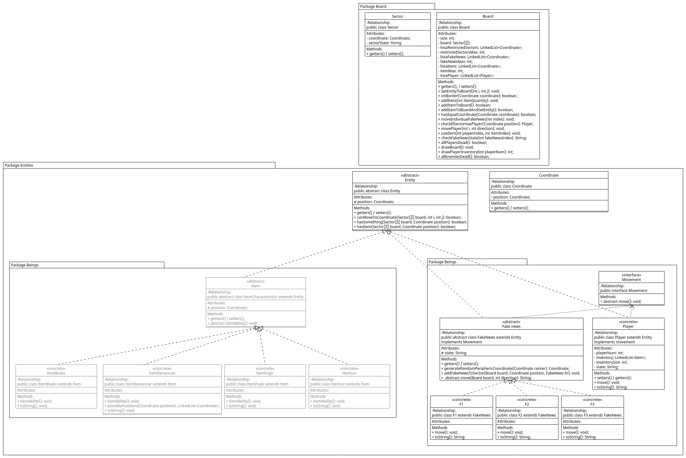

## Introdução

Dividimos o trabalho em três partes principais:

- Board
- Entities
- Main

Cada uma implementando os conceitos de orientação a objetos, e **separando as responsabilidades de cada classe**.

Vamos detalhar cada uma das partes a seguir. Depois, vamos listar os requisitos do trabalho e como eles foram implementados.

## Desenvolvimento

### Board

- **Board class**
  - Criação do tabuleiro (uma matriz de setores)
  - criação das entidades
  - Criação dos itens
  - Movimentação das entidades
- **Sector class**
  - Estado do setor (vazio, restrito, ocupado com Player ou Fake News, com item)
  - `Coordenada` do setor

É o package responsável por **gerenciar o tabuleiro do jogo, e as entidades** que estão nele.

Nele está presente a classe Board, que é responsável por gerar o tabuleiro, e gerenciar as entidades. Ele também é responsável por gerenciar a interação entre as entidades.

### Entities

- **Entity class (Abstrasta)**
  - `Coordenada` da entidade
  - Estado da entidade (vivo, morto, adicionado recentemente ou removido do jogo)

É o package responsável por **implementar as entidades do jogo**, e seus metódos e atributos.

Temos 2 entidades principais, o jogador e a fake news. **Ambas herdam da classe abstrata Entity**, que contém os atributos e métodos comuns entre as entidades. Elas também **`implementam` a interface** Movement, que contém o método move, que é responsável por mover as entidades.

- **Player class**
  - Inventário do jogador
  - Tamanho máximo do inventário
  - Método para mover o jogador
  - Método para adicionar item ao inventário
- FakeNews class (Abstrata)
  - Método para adicionar uma fake news a um Setor

Cada uma das 3 Fake News irá implementar seu próprio movimento e pode ter suas funções auxiliares.

- **Item Characteristics (Abstrata)**
  - `Coordenada` do item
  - Método para usar o item (Abstrato)

Cada um dos 3 itens irá implementar seu próprio método de uso.

### Coordinate

- **Coordinate class**
  - Um par `i,j` que representa a coordenada de um setor
  - Métodos para calcular a distância entre duas coordenadas e conferir se coordenadas são válidas

### Cores

- Color class
  - Variáveis **estáticas** para as cores

### Main

É a classe principal do jogo, que contém o método `main`, e é responsável pelo **loop principal** do jogo e pela **interação** com o usuário.

Nela, dividimos o loop principal em 4 grandes partes:

- lógicas de vitória e derrota
- movimento do jogador
- usar item
- movimento das fake news

## Requisitos

Os requisitos indicados, e onde como cada um foi implementado, foram:

1. **Classes (atributos e métodos)**
    - Board
    - Entity
    - Player
    - Fake News
    - Item
    - Cores
2. **Construtores**
    - **Todas** as classes possuem construtores
3. **Encapsulamento**
    - **Todas** as classes abstratas possuem atributos **privados**, e métodos públicos
4. **Herança**
    - Player e Fake News **`herdam`** de Entity
    - Itens **`herdam`** de Item Characteristics
5. **Interface**
    - Players e Fake News **`implementam` a interface** Movement
6. **Classe Abstrata**
    - Entity
    - Fake News
    - Item Characteristics
7. **Polimorfismo**
    - Polimorfismo de **Inclusão** no método move
    - Polimorfismo de **Coerção DownCast** nos metódos de ação de cada item e no movimento de cada fake news
8. **Coleção**
    - O inventário, Lista de Fake News, Lista de players e Lista de Itens são coleções são listas ligadas
    - Os metódos move de cada entidade utilizam HashMaps para mapear as direções

## Organização do desenvolvimento

Para evitar problemas e **seguir boas práticas de desenvolvimento de código**, utilizamos o **git** para versionar o código e, durante seu uso, um padrão de commits foi seguido da seguinte forma:

```text
[<tipo>] <mensagem>
```

Onde `<tipo>` pode ser:

- `[add]` para adição de novas funcionalidades
- `[fix]` para correção de bugs
- `[refactor]` para refatoração de código
- `[style]` para alterações que não afetam o código (ex: mudanças no README)
- `[test]` para adição de testes
- `[change]` para mudanças que não se encaixam em nenhum dos anteriores
- `[remove]` para remoção de funcionalidades ou arquivos

Além disso, dividimos o desenvolvimento em **duas `branches`** principais. Uma chamada `Main` e outra `Develop`.

Fizemos isso para que a branch `Main` sempre estivesse com o código **estável**, e a `branch` `Develop` fosse utilizada para o **desenvolvimento de novas funcionalidades**.

Por fim, utilizamos as funcionalidades do `javadoc` para documentar o código e facilitar o desenvolvimento em pares além de facilitar a leitura do código.

## Conclusão

O jogo foi implementado com sucesso, e atendeu a todos os requisitos do trabalho. A estrutura do projeto ficou da seguinte forma:

Abaixo temos um diagrama UML, tentando abstrair as estruturas como mostrado nos diagramas em aula.


